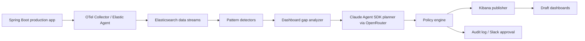

# Full Setup Guide

This guide creates a local version of the production idea:

1. Spring Boot emits telemetry.
2. OpenTelemetry Collector receives telemetry.
3. Elasticsearch stores logs, metrics, and traces.
4. Kibana visualizes the data.
5. A TypeScript agent detects useful patterns.
6. Claude Agent SDK, pointed at OpenRouter, plans draft dashboards.
7. Kibana APIs create draft dashboard objects.

## 1. Local Prerequisites

Install:

- Docker Desktop
- Java 21
- Maven 3.9+
- Node.js 20+
- An OpenRouter API key

## 2. Start Elastic, Kibana, and OpenTelemetry

From the repository root:

```bash
docker compose up -d
```

Open:

- Kibana: http://localhost:5601
- Elasticsearch: http://localhost:9200

Check Elasticsearch:

```bash
curl http://localhost:9200/_cluster/health?pretty
```

## 3. Run the Spring Boot Demo App

```bash
cd springboot-app
mvn spring-boot:run
```

For the most complete local telemetry, run with the OpenTelemetry Java agent so logs, metrics, and traces are all exported through OTLP:

```bash
cd springboot-app
curl -L -o ../opentelemetry-javaagent.jar \
  https://github.com/open-telemetry/opentelemetry-java-instrumentation/releases/latest/download/opentelemetry-javaagent.jar

MAVEN_OPTS="-javaagent:../opentelemetry-javaagent.jar" \
OTEL_SERVICE_NAME=checkout-service \
OTEL_RESOURCE_ATTRIBUTES=service.version=local-dev,deployment.environment=local \
OTEL_EXPORTER_OTLP_ENDPOINT=http://localhost:4318 \
OTEL_EXPORTER_OTLP_PROTOCOL=http/protobuf \
OTEL_TRACES_EXPORTER=otlp \
OTEL_METRICS_EXPORTER=otlp \
OTEL_LOGS_EXPORTER=otlp \
mvn spring-boot:run
```

Generate normal traffic:

```bash
curl "http://localhost:8080/checkout"
curl "http://localhost:8080/checkout?mode=slow"
```

Generate repeated failures:

```bash
curl "http://localhost:8080/load"
curl "http://localhost:8080/checkout?mode=db-timeout"
```

## 4. Verify Telemetry in Elasticsearch

```bash
curl "http://localhost:9200/_cat/indices?v"
```

You should see indices similar to:

```text
logs-springboot-local
metrics-springboot-local
traces-springboot-local
```

In Kibana, create data views:

- `logs-springboot-local*`
- `metrics-springboot-local*`
- `traces-springboot-local*`

Use `@timestamp` as the time field.

## 5. Configure the Agent

```bash
cd agent
npm install
cp .env.example .env
```

Edit `.env`:

```bash
OPENROUTER_API_KEY=your-openrouter-key
ANTHROPIC_API_KEY=your-openrouter-key
ANTHROPIC_BASE_URL=https://openrouter.ai/api
ANTHROPIC_MODEL=openrouter/free
AGENT_DRY_RUN=true
```

Why both `OPENROUTER_API_KEY` and `ANTHROPIC_API_KEY`?

The Claude Agent SDK reads Anthropic-style environment variables. OpenRouter documents an Anthropic Agent SDK integration that points `ANTHROPIC_BASE_URL` at OpenRouter and uses your OpenRouter key as `ANTHROPIC_API_KEY`.

For local experimentation, `openrouter/free` is convenient because it routes to available free models. For production, pin a specific stable model instead of using a random free router.

## 6. Run the Agent

```bash
npm run dev
```

With `AGENT_DRY_RUN=true`, the agent prints the dashboard plan but does not mutate Kibana.

When the plan looks good:

```bash
AGENT_DRY_RUN=false npm run dev
```

The starter publisher creates an empty draft dashboard with the right title, description, and search source metadata. For production dashboards with real panels, use the template workflow below.

## 7. Production Dashboard Template Workflow

Do not let the LLM invent Kibana Lens saved-object JSON directly. Use this workflow:

1. A human creates a high-quality dashboard in Kibana for one pattern type.
2. Export the dashboard and related Lens/data-view saved objects as NDJSON.
3. Replace service-specific values with placeholders:

```text
{{SERVICE_NAME}}
{{ENVIRONMENT}}
{{EXCEPTION_CLASS}}
{{TIME_RANGE}}
{{DASHBOARD_TITLE}}
```

4. Store the template under `agent/templates`.
5. The agent fills placeholders.
6. The Kibana publisher imports the NDJSON through Kibana's saved objects import API.
7. The object is tagged `ai-generated`, `draft`, and `service:<name>`.

Recommended templates:

- `exception-spike.ndjson.template`
- `latency-regression.ndjson.template`
- `deployment-regression.ndjson.template`
- `dependency-failure.ndjson.template`
- `jvm-pressure.ndjson.template`

## 8. Production Architecture



## 9. Detection Rules to Add Next

Start with deterministic detectors:

- New exception class count over threshold.
- 5xx spike by endpoint.
- p95/p99 latency regression by endpoint.
- Error increase after `service.version` changed.
- JVM heap or GC pressure correlated with latency.
- DB timeout or connection pool exhaustion.
- External dependency failure.
- Tenant/customer-specific impact.

Only after a detector finds a statistically meaningful pattern should the LLM planner run.

## 10. Guardrails

For production:

- Default to draft dashboards.
- Never edit human-owned dashboards automatically.
- Enforce a dashboard quota per service per day.
- Require confidence and impact thresholds.
- Deduplicate by service, pattern type, exception class, and time window.
- Auto-expire unused AI dashboards.
- Store every agent decision in an audit index.
- Pin model versions for reproducibility.
- Keep OpenRouter free models out of production workflows.

## 11. Useful Official Docs

- Claude Agent SDK: https://docs.claude.com/en/docs/agent-sdk/overview
- OpenRouter free router: https://openrouter.ai/docs/guides/routing/routers/free-router
- OpenRouter Anthropic Agent SDK integration: https://openrouter.ai/docs/guides/community/anthropic-agent-sdk
- OpenTelemetry Spring Boot: https://opentelemetry.io/docs/zero-code/java/spring-boot-starter/
- Kibana APIs: https://www.elastic.co/guide/en/kibana/current/api.html
- Kibana saved objects APIs: https://www.elastic.co/docs/api/doc/kibana/group/endpoint-saved-objects
